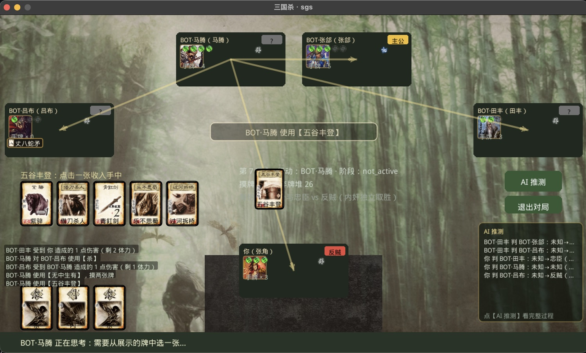

# sgs

Lua / LÖVE2D 实现的三国杀身份局：可 headless 回归的纯 Lua 规则引擎、
接入美术与音频的牌桌 UI，以及 **LLM 驱动的 AI 玩家**（任意座位可托管，
AI 带跨步骤记忆推理隐藏身份）。

<p align="center">
  
</p>

当前进度：**单机体验完整可玩** —— 标准版 108 张牌堆、60 将名册、开局选将
（主公 5 选 1 / 其余 3 选 1）、完整对局流程（胜负判定、终局亮出全部身份）、
表现层（技能指向箭头、出牌/响应/装备飞牌动画、按性别的卡牌音效、台词串行播放）、
菜单三档 AI 思考开关与「AI 推测」身份猜测过程展示。
sgs.* 兼容层可加载社区 DIY 扩展的**技能定义**。
联机（D）核心链路已通（联机/重连/观战/聊天，空座可 `SGS_NET_AI` 交给 LLM），
缺多房间大厅。

**数量口径**（实测，防止与文档脱节）：

| 项 | 数量 | 说明 |
| --- | --- | --- |
| 武将 | 60 | 蜀 15 / 魏 15 / 吴 15 / 群 15 |
| └ 标准版 | **25** | 蜀 7 / 魏 7 / 吴 8 / 群 3 —— 与《基础版全表》对标，由测试断言锁死 |
| └ 扩展 | 35 | 风/火/林/山/一将成名等 |
| 技能条目 | 120 | 60 将 × 2（含主公技与派生子技能） |
| 卡种定义 | 39 | 基本 8 + 锦囊 16 + 装备 15（武器 9，标准版 5 张齐） |
| 牌堆 | **108** | 标准版预设，花色点数固定（`src/core/deck_spec.lua`） |

对标与修复记录见 `AUDIT-标准版对标.md`（含 §G 修复记录）。

资源已**自带**在 `assets/`（约 28MB），开箱即用；`SGS_ASSET_ROOT`
可显式指向其它资源根，缺资源时全部安全降级。

测试：**核心 639 + UI 161 + AI 117 = 917 全通过**（另有网络 54 走 `--net`、
压测 6 组走 `--soak`：60 将逐将覆盖 + 多种子回归 + 卡牌守恒）。

## 牌堆口径

默认 **标准版 108 张**，花色点数按官方对照表**固定**（`src/core/deck_spec.lua`），
只洗序随机。另有 `extended` 预设（标准版 + 军争篇混堆，花色点数随机）：

```lua
Standard.PRESET = "extended"   -- 切回混堆；默认 "standard"
```

## 对局规模

身份局支持 **4 / 5 / 8 人**，**默认 5 人**，**推荐 8 人**：

| 人数 | 配置 | 说明 |
| --- | --- | --- |
| 5 | 主1 忠1 反2 内1 | **默认**，节奏适中 |
| 8 | 主1 忠2 反4 内1 | **推荐**，官方标准局，身份博弈最完整 |
| 4 | 主1 忠1 反1 内1 | 最小可玩局 |

另有 1v1 死斗（2 人）。服务端默认开 5 座。

默认**开局选将**：主公从 5 张候选选 1、其余各从 3 张选 1（候选互不重复，
菜单「开局选将」开关，关掉则回到随机分将）。随机分配走
`Standard.pickGenerals`（Fisher-Yates 洗牌）：同一种子可复现、不同种子
阵容不同，且不出现白板/剑阁占位将；
diy/ 示例扩展的武将同样**默认不进随机池**（只供测试验证兼容层，
需要抽到时给选将函数传 `opts.demo = true`）。
以前是按固定名单取模分配 —— 座位 1 永远张飞、座位 5 又绕回张飞，
于是每局武将都一样、桌位之间还重复。
对局类测试（压测/网络）统一用 **5 人局与 8 人局**；4 人仅保留配置表校验。

## 操作方式

**点选**：点手牌 → 点目标武将。
**拖拽**：按住手牌拖到武将面板上松手即打出（两种方式等价，可混用）。
**技能说明**：点击任意角色的武将头像（联机牌桌点击武将名区域）查看技能说明；按 Esc、点“关闭”或点弹层外区域关闭。
**卡牌说明**：点击任意角色的装备/判定区小牌，弹出该牌的详细说明。

拖拽时：合法目标描**绿边**，鼠标悬停的非法目标描**红边**；
提示条实时显示「攻击范围 N · 到某某 距离 M」，距离不够会直接给出原因
（如「距离 2 超出攻击范围 1」）且**不会打出**。
松手在空白处只回到已选中状态，不取消选择。

距离/出杀次数/禁止技一律由引擎判定（`Room:canUseCardOn`），UI 不自己算规则。

座位沿**顺时针**排列：你（底部）→ 左列 → 顶排 → 右列，与引擎按座位号
推进的回合顺序一致（`src/ui/layout.lua`）。

## AI 玩家（LLM 驱动）

最短启动路径（模型接口配置 / 环境变量表 / 常见问题）见
[**AI启动指南.md**](AI启动指南.md)。

任意座位都能交给 AI：菜单上「AI 托管」切三档（关 / 其他座位 / 全部），
进牌桌后按**数字键 1..N** 可随时切单个座位（想让 AI 替你打一手就按 1）。

菜单上「AI 思考」可循环切换思维链强度（关 / 低 / 高，覆盖 `SGS_AI_REASONING`）——
开启后单次调用变慢（高档 12 秒以上），但 AI 的身份推测更细致。AI 参与对局时，
牌桌右侧有「AI 推测」常驻小面板滚动各 AI 的身份判断变化；按钮列【AI 推测】
打开详情弹层（当前判断表 / 变化时间线含理由与思维链摘要 / AI 长期观察）。

**方式一：走本机代理（推荐）**——游戏只跟 127.0.0.1 明文通信，**密钥不进游戏进程**：

```bash
# 终端 1（接口配置全在这边，游戏进程不需要任何密钥/模型名）
export SGS_AI_URL="https://llm.example.com/v1/responses"
export SGS_AI_KEY="sk-..."
export SGS_AI_MODEL="你的模型名"    # 请求体缺 model 时代理自动注入
./tools/ai_proxy.py                 # 默认 127.0.0.1:8899，加 -v 看完整请求/响应

# 终端 2
export SGS_AI_TRANSPORT=proxy
./run-game.sh
```

**方式二：直连 HTTPS**——不用起代理，但密钥要经过游戏进程：

```bash
# 直连（Responses API）
export SGS_AI_URL="https://llm.example.com/v1/responses"
export SGS_AI_KEY="sk-..."
export SGS_AI_MODEL="你的模型名"     # 必填，不写死：按你的接口填
export SGS_AI_REASONING="none"      # ← 关键，见下
./run-game.sh
```

**`SGS_AI_REASONING=none` 必须设**（代码里也是默认值）。hy3 默认满血思维链，
实测单次调用 **12.7 秒**；关掉后 **1.4 秒**，一局从一小时变成几分钟。
参数必须写成 `{"reasoning": {"effort": "none"}}` —— 传 `"low"` 不被识别（会退回默认值），
传顶层 `reasoning_effort` 完全无效。这两条都是实测踩出来的。

其它环境变量：`SGS_AI_MODEL`（模型名不写死，按接口填；**curl 直连必配**，
proxy 模式可只配在跑 ai_proxy.py 的那个终端、由代理注入）、
`SGS_AI_PROTOCOL`（chat / responses，默认按 URL 猜）、
`SGS_AI_TRANSPORT`（curl / proxy）、
`SGS_AI_THINKING`（chat 协议的思维链开关，GLM 系 `thinking.type`；
默认跟随「AI 思考」档位——关=disabled；`auto` 不发该字段，留给不认
这个参数的严格网关）。直连缺必要变量时 AI 不启用，菜单/牌桌会提示原因。

两种方式都不配也能玩：AI 会退化成**被动兜底**（不出牌、不响应，模型失联时最安全），不会卡死。

排查 AI 问题先跑自检（配置/连通/延迟/决策格式一次出结论）：

```bash
./tools/lua.sh tools/ai-check.lua
```

想看 AI 到底在想什么（含身份判断与长期观察）：`./tools/lua.sh tools/ai-demo.lua`。

### 联机对局里用 AI

服务端设 `SGS_NET_AI` 后，**空座改由 LLM 顶替**（而不是规则 BOT），
传输层与单机共用同一套 `SGS_AI_*` 环境变量，走 love.thread 后台线程，
不会阻塞服务端 tick：

```bash
export SGS_NET_AI=1          # 1/on/all = 全部空座；"2,3" = 指定座位（人来了人优先）
export SGS_AI_URL="..."      # 同单机配置
./tools/serve.sh
```

不设或设为 `off/0` 就是原来的规则 BOT 行为。

### AI 是完全自主的

| 设计 | 说明 |
| --- | --- |
| **所有请求都交给 LLM** | 包括出闪、出桃、无懈可击这类高频响应，不再是「关键决策才问」 |
| **规则 BOT 不参与决策** | 上一版失败会回落 BOT，现在改为**重试**（把错误回喂给模型让它自纠）+ 机械选择兜底 |
| **跨步骤记忆** | 每个座位一份：走过的每一步、写下的理由、对各自身份的判断，每次请求完整回放 |
| **只给该玩家可知的信息** | 别人手牌只给张数、未亮身份显示「未知」，否则身份局等于开图作弊 |
| **只在枚举出的编号候选里选** | 结构上不可能出非法动作；提示词短、解析稳 |

记忆让 AI 能像人一样积累推理。实际跑出来的例子：

```
【你的决策史】共 5 步
  第1轮 出牌：使用【桃园结义】｜桃园结义全员回血，反贼自保助阵
  第1轮 出牌：使用【决斗】→P3｜决斗主公孙权，反贼直击目标
【你自己的长期观察】我是反贼P1刘备，目标杀主公P3孙权，其余身份未明。
【你上次对各自身份的判断】P3：主公
```

主线程不等网络：请求丢给后台线程跑 curl，UI 每帧 poll。

> 为什么是 curl 而不是 `socket.http`：LÖVE 内置的 LuaSocket **没有 luasec**
> （`ssl.https` 直接 require 失败），而 LLM 接口一律 HTTPS。系统 curl 支持 TLS，
> `io.popen` 实测可用；每次 fork 一个进程约几十毫秒，相比 LLM 的 1~3 秒可忽略。
> 密钥与请求体都写进 **600 权限的临时文件**，用 `-H @文件` 传给 curl——
> 直接拼进命令行的话，同机任何用户 `ps aux` 就能看到你的 key。

```
src/core/ai/view.lua      观察层（信息隐藏）
src/core/ai/memory.lua    跨步骤记忆：决策史 + 身份判断 + 长期观察
src/core/ai/actions.lua   合法动作枚举（复用 canUseCardOn 等引擎校验）
src/core/ai/prompt.lua    提示词（观察 + 记忆 + 候选 + 输出格式）
src/core/ai/parse.lua     解析 + 校验（编号越界/数量不符一律拒）
src/core/ai/agent.lua     响应源：异步状态机 + 重试/机械兜底（不碰规则 BOT）
src/core/ai/transport.lua 传输层（mock / curl / proxy），chat 与 responses 双协议
src/ui/ai_transport.lua   LÖVE 实现：love.thread + curl/socket，不阻塞主线程
tools/ai_proxy.py         本机明文代理（标准库 http.server + urllib，零依赖）
```

## 表现层（音效与动效）

引擎 `emit` 出 `useCard / damage / skill / death / respond / equip / skillTarget`
七个表现层事件，UI 挂上去做表现（core 只调回调，不依赖 UI）：

| 事件 | 表现 |
| --- | --- |
| 出牌 `useCard` | 卡牌音效（按出牌人性别选声）+ 横幅 + **卡牌飞向目标** + 多目标指向箭头 |
| 受伤 `damage` | 受击音效 + 目标面板浮起红色 -N + **来源→受害者的红色指向** |
| 发动技能 `skill` | 技能台词 + 横幅 + 该武将面板闪一圈金边 |
| 打出响应 `respond` | 谁被闪/无懈/求桃都有反馈：音效 + 「X 打出【Y】」横幅 + 面板高亮 + 飞牌（BOT 的响应不再无声无息） |
| 装备上阵 `equip` | 武器/防具/马各有音效 + 牌从手里飞到自己面板 + 绿色高亮 |
| 技能指向 `skillTarget` | 施法者 → 目标的金色指向箭头 |
| 阵亡 `death` | 阵亡台词（按武将拼音）+ 横幅 |

装备/判定区以信息格展示：小卡图 + 牌名，马匹带距离标注（防御马+1 / 进攻马-1），
延时锦囊（乐不思蜀等）红边可见；点击任意小牌弹出卡牌说明。

**台词独占（语音串行）**：技能/阵亡台词播放期间演示队列原地等待，
上一条语音播完才轮到下一个行动——不再互相截断。短音效不受影响。

> 动效是自己实现的：原版 `skins/defaultSkin.animation.json` 在这个皮肤里是空的。

**演示节奏**：引擎是同步推进的，一次 `driver:advance()` 可能跑完十几个 BOT 行动，
直接播会让十几条语音和特效在同一帧一起触发、全部重叠。
所以表现事件先进 `presentQueue`，再由 `update` 按节奏逐条播放：

| 事件 | 间隔 |
| --- | --- |
| 出牌 / 装备 | 0.42s |
| 发动技能 | 0.62s（台词最长） |
| 受伤 / 技能指向 | 0.34s |
| 打出响应 | 0.5s |
| 阵亡 | 0.85s |

队列排空前**不推进引擎、不接受玩家操作**（提示「对手行动中…」），
避免「状态已推进、画面没跟上」的错位。
> **音频与视觉是两件事**——横幅不依赖台词是否播放成功，
> 否则没台词的技能（如被动技【马术】）和无音频环境下会完全没有反馈。

## 工具脚本

项目自带便携版 LÖVE（`tools/love.app`，11.5），无需额外安装。
所有脚本都从**项目根目录**执行。

| 脚本 | 用途 |
| --- | --- |
| `./run-tests.sh` | 静态检查 + 单测（核心 639 + UI 161 + AI 117） |
| `./run-soak.sh` | 压测（60 将逐将覆盖 + 多种子回归 + 卡牌守恒） |
| `./run-game.sh` | 图形界面 |
| `./tools/lua.sh <脚本.lua>` | **跑任意 Lua 脚本**（用游戏同款 LuaJIT，见下） |
| `./tools/serve.sh [端口] [座位数]` | 联机服务端（默认 9527 / 5 座） |
| `./tools/join.sh [名字] [host] [port]` | 联机控制台客户端（自动应答） |
| `./tools/play.sh [名字] [host] [port]` | 联机**图形**客户端 |

不常用的入口（脚本已封装，一般不用直接敲）：

```bash
./tools/love.app/Contents/MacOS/love . --net    # 网络层测试（含真实 TCP）
./tools/love.app/Contents/MacOS/love . --test   # 同 run-tests.sh
./tools/love.app/Contents/MacOS/love . --soak   # 同 run-soak.sh
```

无头模式靠 `conf.lua` 在 `--test` / `--soak` / `--net` 下关闭窗口实现，
**不要**用 `SDL_VIDEODRIVER=dummy`（macOS 的 dummy 驱动建不出 OpenGL 上下文，会弹错误框）。

## Windows 环境

引擎/UI/网络层本身跨平台，需要自备一份 **LÖVE 11.5**。最省事的方式是
一条命令自动下载便携版（Windows 10 1803+，自带 curl 与 tar）：

```bat
tools\get-love.bat
```

它会从 love2d 官方 release 下载 `love-11.5.0-win64.zip` 并解压到
`tools\love-win64\`（`.gitignore` 已排除，不入库），之后所有 `.bat` 都能
直接用。也可以手动获取（任选其一）：

1. **安装版**：从 [love2d.org](https://love2d.org) 安装，`love` 进 PATH；
2. **便携版**：下载 zip 解压到 `tools/love-win64/`。

配好后在项目根目录用 Windows 版脚本（与 `.sh` 一一对应，自动找 PATH 或
`tools/love-win64/` 里的 love.exe）：

| 脚本 | 用途 |
| --- | --- |
| `run-game.bat` | 图形界面 |
| `run-tests.bat` | 静态检查（有 python 才跑，缺了跳过）+ 单测 |
| `tools\serve.bat [端口] [座位数]` | 联机服务端（默认 9527 / 5 座） |
| `tools\play.bat [名字] [host] [端口]` | 联机图形客户端 |

也可以直接 `love . --test` / `love .` / `love . --serve 9527 5`。

**AI 玩家在 Windows**：直连模式（`SGS_AI_TRANSPORT=curl`）已适配 cmd.exe
（双引号转义 + `%TEMP%` 临时文件 + `del` 清理，Windows 10 1803+ 自带 curl）；
代理模式（`SGS_AI_TRANSPORT=proxy` + `python tools/ai_proxy.py`）走纯
LuaSocket，同样可用。

## 跑 Lua 代码：`tools/lua.sh`

本机 PATH 里没有 `lua` / `luajit`，但 LÖVE 自带了 **Lua 5.1 / LuaJIT 2.1**
（游戏运行时用的就是它）。`tools/lua.sh` 把它包成一个 CLI，
**保证验证代码时的解释器版本与游戏完全一致**。

```bash
./tools/lua.sh 脚本.lua                    # 运行脚本
echo 'print(_VERSION)' | ./tools/lua.sh -  # 跑一行代码（从标准输入读）
```

脚本内可直接 `require "src.core.*"`（package.path 已指向项目根）：

```bash
$ echo 'local C=require "src.core.cards"; print(C.get("slash").zh)' | ./tools/lua.sh -
杀
$ echo 'print(_VERSION, jit.version)' | ./tools/lua.sh -
Lua 5.1 LuaJIT 2.1.1700008891
```

> 局限：`src/ui/*` 需要 `love.graphics` 等模块，windowless 下不可用。
> UI 相关请走 `./run-tests.sh`（`test_ui.lua` 用的是打桩的 love）。
> core/ 不依赖 love，可以放心在这里跑。
>
> 若想在命令行装一个通用 `lua`：要装 **LuaJIT 2.1**（对标 Lua 5.1），
> 不要装默认的 Lua 5.4 —— 本项目用了 5.1 专有的 `setfenv`，5.4 加载就报错。

## 结构（详见 DESIGN.md）

```
src/core/     纯 Lua 规则引擎（零 love 依赖，headless 可测）
src/compat/   sgs.* 兼容层，加载 diy/ 下的原版社区扩展
src/ui/       LÖVE 场景（菜单/牌桌）+ 皮肤/音频/布局/动效
diy/          DIY 扩展示例 3 份（武将包）：转化技 / 技能牌 / 询问类 API
              （示例武将不进正常对局的随机池，见 Standard.DEMO_PACKAGES）
tests/        BOT vs BOT 全量对局测试 + 多种子回归 + 卡牌守恒
tools/        love.app（LÖVE 便携版）、lua.sh、serve.sh、join.sh、
              lint_methods.py（点号/冒号检查）
assets/       资源：image/  audio/  skins/  font/（自带，无需原项目）
```

**术语**：`BOT` = 规则驱动的脚本对手（`src/core/bot.lua`，无学习/推理/搜索）；
`AI` = 由 LLM 驱动的玩家（`src/core/ai/`）。两者是**并列**的响应源，
详见 DESIGN.md「五、开发约定 0」与下面的「AI 玩家」一节。

## 路线图

| 阶段 | 内容 | 状态 |
| --- | --- | --- |
| A0 | 骨架 + 迷你局 + headless 测试 | ✅ |
| A1 | 标准包全量 + 60 将技能 | ✅ |
| B | sgs.* 兼容层 + diy/ 扩展加载器 | ✅（国战机制与 bot 提示表按决策不做） |
| C | 完整 UI（皮肤/布局/音频/动效/选将/菜单） | ✅ |
| D | LuaSocket 网络服务端 + 多人 | 🚧 进行中（联机/重连/观战/聊天/UI 联调已完成，空座可设 SGS_NET_AI 交给 LLM，缺多房间大厅） |
| E | 标准版对标补齐（濒死救援/主公技/武器/花色表） | ✅ 完成，见 `AUDIT-标准版对标.md` 与 `PLAN-标准版补齐.md` |
| F | LLM 驱动的 AI 玩家 | ✅ 完成：mock 全链路 117 项测试 + 真机实测（关思维链后一局约 6 分钟）；思考三档开关、身份推测过程展示、联机 AI 均已接入 |

**E 阶段背景**：对照「基础版武将与卡牌全表」「身份局游玩说明」两份文档审计后，
发现角色/牌型/规则上的缺口，审计结论见 `AUDIT-标准版对标.md`，
实施计划（任务拆解 + 验收用例 + 提交切分）见 `PLAN-标准版补齐.md`。

E 阶段已落地：濒死救援轮询全场、主公技三件套（护驾/激将/救援）、
补齐 9 件标准武器（含丈八蛇矛与贯石斧的效果）、诸葛亮【观星】、陆逊【连营】、
牌堆改为文档标准版 108 张 + 固定花色点数、判定区后进先判与同名唯一、
8 项技能语义修正。
主公选将流程已完成（菜单「开局选将」开关，主公 5 选 1 / 其余 3 选 1）；
仍缺（已记在 PLAN）：部分技能的玩家侧交互界面。

## 联机（阶段 D，进行中）

```bash
./tools/serve.sh [端口] [座位数]   # 启动服务端（默认 9527 / 5 座）
./tools/join.sh  [名字] [host] [port]   # 控制台客户端，连上并自动应答
./tools/love.app/Contents/MacOS/love . --net   # 网络层测试（内存通道，不占端口）
```

已验证（真机两进程 + 进程内真 socket 自动化测试）：
监听 → 接入占座 → ready → **开局** → 请求/应答 → **打完一局** → 广播 over。
客户端能实时收到 log、在需要时收到 req 并应答。

架构：服务端持有权威 `Room`；连上来的客户端占座（人类），空座由 BOT 顶替
（设 `SGS_NET_AI` 后改由 LLM 决策，见上文「联机对局里用 AI」）。
`Driver` 遇到人类请求会返回 `"human"`，Host 就把请求发给对应座位并等待应答；
AI 座位则返回 `"thinking"`，下一帧接着问，主循环不阻塞。

```text
src/net/protocol.lua   协议：一行一个 JSON；消息体只放可序列化数据
src/net/host.lua       房间 / 座位 / 同步 的权威层（不碰 socket，只认通道）
src/net/channel.lua    通道抽象：内存（测试） / TCP（真实）
src/net/server.lua     LuaSocket TCP 适配
src/net/client.lua     客户端：收消息、应答请求
```

测试分两层：主体走**内存通道**（不占端口、不依赖时序，完全确定），
另有「真实 TCP」一组（回环 socket，端口动态取，监听失败则 SKIP）。

## 断线重连 / 观战 / 聊天

```bash
# 掉线：服务端保留座位 60 秒（Host.dropSeat），不是立即清空
# 重连：客户端凭 welcome 下发的 token 发 {type:"resume", token} 坐回原座
# 观战：hello 带 spectate=true —— 不占座，只收 log/state/chat
# 聊天：{type:"chat", text}，服务端记 50 条历史并广播；新连入者会补发
```

真机已验证：观战者收到 22 条日志；观战席发的聊天能到达玩家客户端。
观战者不在 `clients` 表里（没占座），所以服务端要单独 drain 他们，
否则他们发的消息永远没人读（踩过）。

**服务端是常驻的**：一局结束不退出，清掉 ready 后可再开下一局
（原来打完就退出，导致后连的人根本连不上）。

**多客户端联机**（同一台机器开多个窗口即可）：

```bash
./tools/serve.sh                 # 终端 1：服务端（默认 9527 / 5 座）
./tools/play.sh 甲               # 终端 2：图形客户端
./tools/play.sh 乙               # 终端 3：再开一个
```

- 座位按连接顺序分配，空座由 BOT 顶替
- **至少 2 个真人准备后才开局**（`Host.minStart`，默认 2）——否则第一个人
  一 ready 就开局，后面连进来的人只能干等这一局打完（实测踩过）
- 对局进行中新连入的人**先观战**，下一局自动上场
- 想单人练手：`./tools/serve.sh 9527 5 1`（第三个参数是 minStart）
- 换机器：客户端 `./tools/play.sh 甲 192.168.1.5 9527`，
  或设 `SGS_NET_HOST` / `SGS_NET_PORT`

UI 联调已完成：菜单「联机对战」或 `./tools/play.sh` 进入图形联机牌桌
（`src/ui/scene_net.lua`）。它与本地单机牌桌是两套：

```
scene_room = 本地单机（自己持有权威 Room + Driver）
scene_net  = 联机客户端（权威在服务端，这里只渲染快照并应答）
```

服务端 `req` 会附带本人手牌（`msg.hand`），客户端才点得出牌。
可用 `SGS_NET_HOST` / `SGS_NET_PORT` 覆盖连接目标。

尚未做：多房间大厅。

## 已知限制

按「有意为之」与「尚未覆盖」分开列，避免接手时误判成 bug：

**有意为之（决策结果）**

- **不做国战机制**，只做标准身份局 → 邹氏的【祸水】【倾城】纯属国战机制，
  她在名册里保留占位但**无技能**
- **不消费原版 bot 提示表**（`sgs.ai_*`）。表名继续保留（DIY 脚本会往里塞值，
  改名就崩），但引擎不读；决策逻辑走自己的 `src/core/bot.lua`
- `defaultSkin.audio.json` / `animation.json` 在原版里**是空的**，所以音效按
  资源目录约定解析（`audio/card/<male|female>/<名>.ogg`、`audio/system/<key>.ogg`），
  动效是自己实现的
- DIY 的 `askForYiji` / `askForExchange` 等是桩实现 —— BOT 没有对应的
  交互界面，强做反而是假的

**尚未覆盖**

- 只移植了**标准包**。原版扩展包（`strategic-advantage` 军争、
  `formation`、`jiange-defense`、`momentum`）未移植
- **宝物**（`sgs.CreateTreasure`）没有对应槽位，映射到防具槽
- DIY 卡牌包（`Package_CardPack`）刚支持，覆盖度不如武将包
- 压测中少量局因长时间拉锯**判平局**（连续 80 回合无人阵亡）——
  是 BOT 打不穿残局囤牌的合法结果，不是死循环；`MAX_TURNS=300` 仍是
  真正的死循环保险
